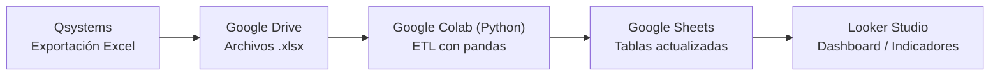

# Automatización de indicadores de mantenimiento (Qsystems → Google Sheets → Looker Studio)

> **Enfoque del proyecto:** **BI / Analytics Engineering** (automatización de extracción, limpieza, transformación y modelado de datos para analítica y tableros).  
> **Stack:** Qsystems (exportación Excel) · **Python (Google Colab)** · **pandas / numpy** · **Google Drive & Google Sheets API (gspread / googleapiclient)** · **Looker Studio** ·

---

## Descripción
En el área de mantenimiento se necesitaban **indicadores personalizados** que Qsystems no permite configurar.  
El proceso manual (descargar Excel → limpiar/transformar → unir tablas → actualizar tableros) se volvió repetitivo y propenso a errores.

**Solución:** un **pipeline en Python** que toma los Excel exportados, ejecuta **limpieza + transformación**, y **sobrescribe** una tabla final en **Google Sheets** para que **Looker Studio** consuma datos consistentes y actualizados.

---

## Contenido
- [Automatización de indicadores de mantenimiento (Qsystems → Google Sheets → Looker Studio)](#automatización-de-indicadores-de-mantenimiento-qsystems--google-sheets--looker-studio)
  - [Descripción](#descripción)
  - [Contenido](#contenido)
  - [1) Contexto y problema](#1-contexto-y-problema)
  - [2) Objetivo](#2-objetivo)
  - [3) Arquitectura de la solución](#3-arquitectura-de-la-solución)
  - [4) Fuentes de datos y modelo](#4-fuentes-de-datos-y-modelo)
    - [4.1 Archivos de entrada (exportación Qsystems)](#41-archivos-de-entrada-exportación-qsystems)
    - [4.2 Tablas en Google Sheets (salida / consumo BI)](#42-tablas-en-google-sheets-salida--consumo-bi)
    - [4.3 Esquema de la tabla final (ejemplo)](#43-esquema-de-la-tabla-final-ejemplo)
  - [5) Transformaciones (ETL) implementadas](#5-transformaciones-etl-implementadas)
    - [5.1 Limpieza estructural](#51-limpieza-estructural)
    - [5.2 Tipificación de fechas](#52-tipificación-de-fechas)
    - [5.3 Manejo de nulos (data quality)](#53-manejo-de-nulos-data-quality)
    - [5.4 Tratamiento de atípicos (outliers)](#54-tratamiento-de-atípicos-outliers)
    - [5.5 Feature engineering (columnas derivadas para segmentación)](#55-feature-engineering-columnas-derivadas-para-segmentación)
    - [5.6 (Opcional) Métrica de tiempo en solicitudes](#56-opcional-métrica-de-tiempo-en-solicitudes)
  - [6) Capa BI: Looker Studio](#6-capa-bi-looker-studio)
  - [7) Cómo ejecutar / reproducir](#7-cómo-ejecutar--reproducir)
    - [7.1 Requisitos](#71-requisitos)
    - [7.2 Pasos (alto nivel)](#72-pasos-alto-nivel)
  - [8) Resultados e impacto](#8-resultados-e-impacto)
  - [9) Skills demostrados](#9-skills-demostrados)

---

## 1) Contexto y problema
**Qsystems** es un aplicativo web de **gestión del mantenimiento** (preventivo/correctivo), con módulos como:
- solicitudes y órdenes de trabajo
- hojas de vida de equipos
- responsables, ubicaciones, estados, etc.

Qsystems ya trae indicadores “de fábrica”, pero:
- **no permite** crear indicadores nuevos o segmentaciones a la medida,
- cuando mantenimiento necesita una vista específica (por sede, responsable, tipo de solicitud, backlog, etc.) toca **exportar a Excel** y hacerlo “a mano”.

**Dolor principal:** cada descarga manual implica repetir tareas de preparación:
- renombrar/estandarizar columnas,
- concatenar bases (pendientes + terminadas),
- limpiar nulos, columnas innecesarias, datos atípicos,
- construir columnas derivadas para segmentar (preventivo/correctivo, interna/externa, etc.).

A medida que aumentaban los indicadores personalizados, el flujo se volvió **más tedioso**.

---

## 2) Objetivo
Construir un flujo que permita:
1. Partir de los **Excel exportados** desde Qsystems (múltiples archivos).
2. Ejecutar **limpieza + transformación automatizada** en **Google Colab**.
3. Publicar una **tabla final limpia** en **Google Sheets**.
4. Conectar **Looker Studio** a esa tabla para visualizaciones consistentes.

✅ **Resultado esperado:** reducir el trabajo manual repetitivo y facilitar agregar nuevos indicadores **modificando código**, no rearmando Excel cada vez.

---

## 3) Arquitectura de la solución


## 4) Fuentes de datos y modelo

### 4.1 Archivos de entrada (exportación Qsystems)
Los datos llegan en **varios libros Excel**, por ejemplo:
- órdenes **pendientes**
- órdenes **terminadas**
- **ubicaciones**
- **responsables / usuarios de mantenimiento**
- **solicitudes** (abiertas y/o históricas)

> Nota: el pipeline trabaja estos archivos como **inputs independientes** y genera una salida unificada para analítica.

### 4.2 Tablas en Google Sheets (salida / consumo BI)
El proceso actualiza hojas/tablas en Google Sheets (lectura/escritura vía API), por ejemplo:
- `Ubicaciones` (actualizada desde Excel)
- `Responsables` (actualizada desde Excel)
- `Solicitudes` (combinada y tratada)
- **`fac_ordenes`** (tabla final para Looker Studio)

### 4.3 Esquema de la tabla final (ejemplo)
Head (ejemplo) de `fac_ordenes`:

```text
Número | Solicitante / Usuario | Fecha de solicitud | Fecha inicia orden | Descripción | Estado | Equipo | Origen | Tipo de solicitud | Responsable | Sede | Ubicación | Tipo de servicio | Última observación | Descripción del trabajo | Horas de trabajo | Fecha fin. T | Fecha finaliza orden | Recibió | Causa de falla | Tipo de trabajo | tipo de orden
```
---

## 5) Transformaciones (ETL) implementadas

> Implementado en el notebook: `Limpieza_datos_fac_ordenes.ipynb`

### 5.1 Limpieza estructural
Se aplican rutinas de calidad sobre los DataFrames:
- eliminación de **duplicados**
- limpieza de **espacios en blanco** en nombres de columnas
- eliminación de **columnas completamente vacías**

### 5.2 Tipificación de fechas
Conversión explícita a `datetime` en columnas clave para poder analizar tiempos y ventanas:
- `Fecha de solicitud`
- `Fecha inicia orden`
- `Fecha fin. T`
- `Fecha finaliza orden`

### 5.3 Manejo de nulos (data quality)
Estrategia combinada:
- se eliminan registros con nulos en campos críticos (exceptuando columnas permitidas),
- imputaciones específicas por columna para mantener consistencia analítica, por ejemplo:
  - `Ubicación` → `"SIN UBICACION"` (y ajuste de `Sede` a `"SIN SEDE"` cuando aplique)
  - `Última observación` → `"Ninguna"`
  - `Descripción del trabajo` → `"Ninguna"`
  - `Horas de trabajo` → `0`
  - `Causa de falla` → `"No especifica"`
  - `Recibió` → `"No recibido"`
  - fechas nulas de finalización → se completan con `Fecha inicia orden` (para evitar romper métricas)

### 5.4 Tratamiento de atípicos (outliers)
Para evitar distorsión de métricas:
- filtrado por rango en `Número` (ej.: se excluyen valores por debajo de un umbral)
- ajustes puntuales en `Horas de trabajo` para valores extremos (con reglas por responsable, cuando aplica)

> Este punto está orientado a **calidad de indicadores** (evitar que pocos registros anómalos arruinen promedios/tasas).

### 5.5 Feature engineering (columnas derivadas para segmentación)
Columnas creadas/modificadas para habilitar filtros e indicadores en Looker Studio:

- **`Tipo de trabajo`**  
  - `"Preventivo"` si `Origen` contiene `"Cronograma"`  
  - `"Correctivo"` si `Origen` contiene `"Solicitud"`

- **`tipo de orden`** (interna/externa)  
  - se construye una lista de responsables internos desde la hoja `Responsables`
  - si `Responsable` ∈ lista → `"interna"`, si no → `"externa"`

- **Normalización de `Tipo de servicio`**  
  - si `Descripción` contiene `"trello"` → `Tipo de servicio = "Trello"`

- **Normalización de `Estado`**  
  - `"Cerrado sin ejecutar"` y `"Reprogramada"` → `"Anulada"`

- **Ajuste de fechas para preventivos**  
  - para `Tipo de trabajo = Preventivo`, se ajusta `Fecha finaliza orden` según estado
  - en ciertos casos se usa fin de mes (`MonthEnd`) para estandarizar cierres preventivos

### 5.6 (Opcional) Métrica de tiempo en solicitudes
En `Solicitudes` se calcula una columna del tipo:
- `Horas_transcurridas` = diferencia entre fecha actual y fecha de solicitud  
  útil para seguimiento de solicitudes abiertas.

---

## 6) Capa BI: Looker Studio

La tabla `fac_ordenes` se conecta en Looker Studio para construir un dashboard con:
- filtros por **rango de fechas** y **responsable**
- KPIs operativos (ejemplos mostrados en el tablero):
  - solicitudes sin asignar
  - órdenes totales / pendientes
  - hora promedio por solicitud
  - tasa de cumplimiento
  - tasa de backlog
- visualizaciones por:
  - estado de órdenes (distribución)
  - preventivo vs correctivo
  - preventivo ejecutado vs no ejecutado
  - órdenes por tipo de solicitud (treemap)
  - horas reportadas por responsable
 


📌 Ver dashboard en Looker Studio:
[Link](https://lookerstudio.google.com/reporting/9cf84ee0-b370-4d30-be66-e0f866a84cdb)

---

## 7) Cómo ejecutar / reproducir

### 7.1 Requisitos
- Google Colab / entorno Python
- Acceso a Google Drive y Google Sheets vía **cuenta de servicio**
- Librerías usadas:
  - `pandas`, `numpy`
  - `googleapiclient`, `google.oauth2`
  - `gspread`, `gspread_dataframe`
  - (para EDA) `matplotlib`, `seaborn`

### 7.2 Pasos (alto nivel)
1. Exportar los Excel desde Qsystems y guardarlos en Drive.
2. Ejecutar el notebook `Limpieza_datos_fac_ordenes.ipynb` en Colab:
   - descarga/lee los Excel
   - aplica ETL
   - sobrescribe la hoja final `fac_ordenes` en Google Sheets
3. Looker Studio consume la hoja y actualiza visualizaciones.

📌 link al notebook o instrucciones más detalladas: 
[Link](./src/limpieza_datos_fac_ordenes.py)

---

## 8) Resultados e impacto
- Se eliminó gran parte del trabajo manual repetitivo de preparación de Excel.
- La lógica de indicadores/segmentaciones se trasladó a **código versionable**, facilitando:
  - reproducibilidad,
  - control de cambios,
  - incorporación de nuevas reglas de negocio (nuevas columnas, filtros, métricas).
- Looker Studio consume una fuente **limpia y consistente**, mejorando la confiabilidad de los indicadores.

---

## 9) Skills demostrados

- **Data Wrangling / ETL con Python (pandas):** lectura de múltiples fuentes, concatenación, estandarización de columnas y tipos.
- **Data Quality:** manejo de nulos, eliminación de duplicados, eliminación de columnas vacías, reglas de negocio para consistencia.
- **Tratamiento de outliers orientado a métricas:** reglas para evitar sesgo en promedios/tasas.
- **Feature engineering para analítica:** creación de variables derivadas para segmentación (preventivo/correctivo, interna/externa, estados normalizados).
- **Integración con Google APIs:** Drive y Sheets (cuenta de servicio), escritura de DataFrames a Google Sheets.
- **BI / Visual Analytics:** modelado de una tabla de hechos (`fac_ordenes`) y construcción de dashboard en Looker Studio.

---
